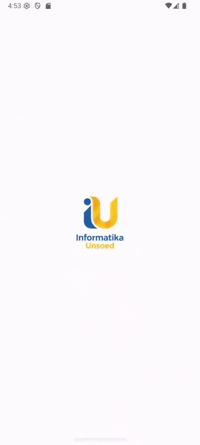

# Tugas-1-Pertemuan-2-Prak-Pemob_H1D023038
Nama : Moreno Hilbran Glenardi
NIM : H1D023024
Shift : H/B

# Dokumentasi


# Tugas-2-Pertemuan-3-Prak-Pemob_H1D023038


# Tugas 3 Pertemuan 4


# Tugas 4 Pertemuan 5


# Aplikasi Tugas 1 Pemrograman Mobile

Proyek ini dibuat sebagai bagian dari Tugas 1 mata kuliah **Pemrograman Mobile**.  
Aplikasi ini menampilkan halaman sederhana dengan gambar, teks sambutan, deskripsi, dan tombol untuk pindah ke halaman berikutnya.

## 📌 Fitur Utama
- Menampilkan gambar gedung teknik di bagian atas.
- Teks sambutan (welcome text) di tengah layar.
- Deskripsi singkat dengan teks yang rata kanan-kiri.
- Tombol "Next" untuk berpindah ke halaman selanjutnya.

## 🛠️ Teknologi yang Digunakan
- **Android Studio**
- **Kotlin**
- **Material Design 3 (Material Components)**
- **LinearLayout** sebagai layout utama

## 📂 Struktur Layout (activity_main.xml)
- `LinearLayout` → Layout utama.
- `ImageView` → Menampilkan gambar gedung teknik.
- `TextView (tv_welcome)` → Menampilkan teks sambutan.
- `TextView (tv_description)` → Menampilkan deskripsi informasi.


# Dokumentasi
- `MaterialButton (btn_to_page2)` → Tombol untuk menuju halaman kedua.

## 🚀 Cara Menjalankan
1. Clone repository ini:
   ```bash
   git clone https://github.com/MorenoHilbran/If-Unsoed-Mobile.git
